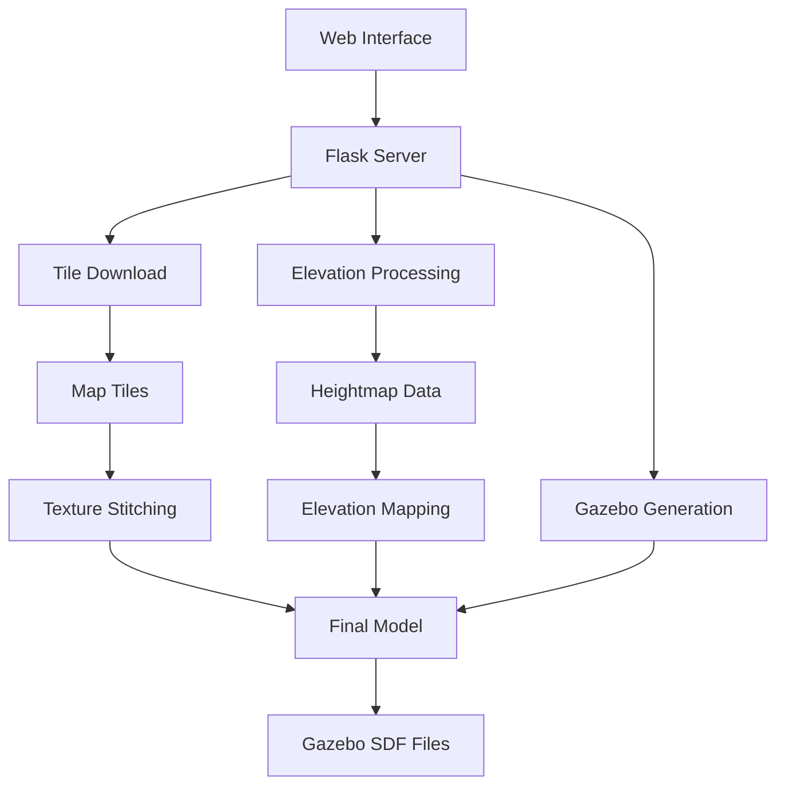

# 🌍 Gazebo Terrain Generator

<div align="center">

[](https://python.org)
[](LICENSE)
[](https://gazebosim.org/)
[](https://maplibre.org/)
[](https://deepwiki.com/saiaravind19/gazebo_terrain_generator)

**Generate realistic 3D Gazebo terrain models from real-world elevation data and satellite imagery**

*No API keys required • Completely open-source • Global coverage*

</div>

---

## 📋 Table of Contents

- [🎯 Overview](#-overview)
- [✨ Features](#-features)
- [🎬 Demo](#-demo)
- [🚀 Quick Start](#-quick-start)
- [📦 Installation](#-installation)
- [⚙️ Configuration](#️-configuration)
- [📖 Usage Guide](#-usage-guide)
- [🏗️ Architecture](#️-architecture)
- [🔧 API Reference](#-api-reference)
- [🛠️ Troubleshooting](#️-troubleshooting)
- [🤝 Contributing](#-contributing)
- [📄 License](#-license)

---

## 🎯 Overview

Gazebo Terrain Generator is a powerful web-based tool that creates photorealistic 3D terrain models for [Gazebo](https://gazebosim.org/) simulation environments. Simply select any location on Earth, and the tool automatically downloads elevation data and satellite imagery to generate complete Gazebo world files.

### Key Advantages
- **🌐 Global Coverage**: Works anywhere on Earth using open elevation data
- **🔓 No API Keys**: Completely free using OpenStreetMap and Open Topo Data
- **🎨 Modern Interface**: MapLibre GL-powered web interface
- **⚡ Fast Processing**: Multi-threaded tile processing and elevation data caching
- **🎯 Precise Control**: Interactive spawn point placement and configurable parameters

---

## ✨ Features

<details>
<summary><b>🌎 Terrain Generation</b></summary>

- **Real-world elevation data** from SRTM 30m global dataset
- **High-resolution satellite imagery** for texture mapping
- **Automatic heightmap generation** with Gazebo-compatible formats
- **Configurable resolution** and zoom levels
- **Custom boundary selection** with interactive drawing tools

</details>

<details>
<summary><b>🗺️ Mapping & Navigation</b></summary>

- **MapLibre GL integration** with multiple tile source options
- **Location search** with Nominatim geocoding
- **Interactive polygon drawing** for region selection
- **Real-time coordinate display** and center point management
- **Grid preview** for tile boundary visualization

</details>

<details>
<summary><b>🔧 Configuration & Output</b></summary>

- **Flexible output paths** via environment variables
- **Multiple export formats** (SDF models, world files, textures)
- **Spawn point customization** with draggable markers
- **Parallel processing** for faster tile downloads
- **Local caching** for elevation data to reduce API calls

</details>

<details>
<summary><b>🚀 Development Features</b></summary>

- **Flask REST API** for programmatic access
- **Background processing** with status tracking
- **Error handling** with graceful degradation
- **Development server** with live reload
- **Comprehensive logging** for debugging

</details>

---

## 🎬 Demo

<div align="center">

[](https://www.youtube.com/embed/TsV34XBntnY?si=zK0TL7pK_RhsNW05)

*Click to watch the demo video*

</div>

---

## 🚀 Quick Start

```bash
# Clone the repository
git clone https://github.com/yourusername/gazebo_terrain_generator.git
cd gazebo_terrain_generator

# Create virtual environment
python3 -m venv terrain_generator
source terrain_generator/bin/activate  # On Windows: terrain_generator\Scripts\activate

# Install dependencies
pip install -r requirements.txt

# Start the server
python scripts/server.py

# Open browser to http://localhost:8080
```

---

## 📦 Installation

<details>
<summary><b>🐧 Ubuntu/Linux Installation</b></summary>

### Prerequisites
- Python 3.7+
- pip package manager
- Gazebo Harmonic (recommended)

### Step-by-step Installation
```bash
# Update system packages
sudo apt update

# Install Python and pip if not available
sudo apt install python3 python3-pip python3-venv

# Clone repository
git clone https://github.com/yourusername/gazebo_terrain_generator.git
cd gazebo_terrain_generator

# Create and activate virtual environment
python3 -m venv terrain_generator
source terrain_generator/bin/activate

# Install Python dependencies
pip install -r requirements.txt

# Verify installation
python scripts/server.py
```

</details>

<details>
<summary><b>🪟 Windows Installation</b></summary>

### Prerequisites
- Python 3.7+ from [python.org](https://python.org)
- Git for Windows

### PowerShell Instructions
```powershell
# Clone repository
git clone https://github.com/yourusername/gazebo_terrain_generator.git
cd gazebo_terrain_generator

# Create virtual environment
python -m venv terrain_generator
terrain_generator\Scripts\activate

# Install dependencies
pip install -r requirements.txt

# Start server
python scripts/server.py
```

</details>

<details>
<summary><b>🐳 Docker Installation (Optional)</b></summary>

```bash
# Build Docker image
docker build -t gazebo-terrain-generator .

# Run container
docker run -p 8080:8080 -v $(pwd)/output:/app/output gazebo-terrain-generator

# Access at http://localhost:8080
```

</details>

---

## ⚙️ Configuration

<details>
<summary><b>🌍 Environment Variables</b></summary>

Configure output paths and behavior using environment variables:

```bash
# Model output directory
export GAZEBO_MODEL_PATH="~/gazebo_models"

# World files directory  
export GAZEBO_WORLD_PATH="~/gazebo_models/worlds"

# Temporary file directory
export TEMP_PATH="/tmp/gazebo_terrain"

# Enable debug logging
export DEBUG_MODE="true"
```

### Default Paths
| Variable | Default Value | Description |
|----------|---------------|-------------|
| `GAZEBO_MODEL_PATH` | `./output/gazebo_terrain/` | Generated models location |
| `GAZEBO_WORLD_PATH` | `./output/gazebo_terrain/worlds/` | World files location |
| `TEMP_PATH` | `./temp/` | Temporary processing files |

</details>

<details>
<summary><b>🗂️ File Structure</b></summary>

Generated models follow this standardized structure:

```
output/gazebo_terrain/
├── model_name/
│   ├── model.sdf              # Gazebo model definition
│   ├── model.config           # Model metadata  
│   └── textures/
│       ├── model_name_height_map.tif    # 16-bit elevation heightmap
│       └── model_name_aerial.png        # Stitched satellite texture
└── worlds/
    └── model_name.sdf         # Complete world file
```

</details>

<details>
<summary><b>🎛️ Server Configuration</b></summary>

Customize server behavior by modifying `scripts/utils/param.py`:

```python
# Server settings
HOST = "0.0.0.0"
PORT = 8080
DEBUG = False

# Processing settings  
MAX_PARALLEL_DOWNLOADS = 4
TILE_CACHE_SIZE = 1000
REQUEST_TIMEOUT = 30

# Elevation settings
ELEVATION_API_BASE = "https://api.opentopodata.org/v1/srtm30m"
CACHE_ELEVATION_DATA = True
```

</details>

---

## 📖 Usage Guide

<details>
<summary><b>🎯 Basic Workflow</b></summary>

### 1. Start the Application
```bash
source terrain_generator/bin/activate
python scripts/server.py
```

### 2. Access Web Interface
Open your browser and navigate to `http://localhost:8080`

### 3. Generate Terrain
1. **Search Location**: Enter any place name in the search box
2. **Draw Region**: Click "Draw Region" and select your area of interest  
3. **Set Spawn Point**: Drag the red marker to desired spawn location
4. **Configure Settings**: Adjust zoom level, tile source, and output name
5. **Generate**: Click "Generate Terrain" and wait for processing

### 4. Use in Gazebo
```bash
# Export model path
export GZ_SIM_RESOURCE_PATH=$GZ_SIM_RESOURCE_PATH:/path/to/your/models

# Launch world
gz sim model_name/model_name.sdf
```

</details>

<details>
<summary><b>🔧 Advanced Configuration</b></summary>

### Custom Tile Sources
Add custom map tile providers in the web interface:

```javascript
// Example: Add custom tile source
"Custom Satellite": "https://server.arcgisonline.com/ArcGIS/rest/services/World_Imagery/MapServer/tile/{z}/{y}/{x}"
```

### Batch Processing
Use the REST API for automated terrain generation:

```bash
# Start terrain generation
curl -X POST http://localhost:8080/start-download \
  -d "boundaries=-122.5,37.7,-122.3,37.9" \
  -d "zoom=16" \
  -d "modelName=san_francisco"
```

### Custom Elevation Sources
Modify elevation data sources in `scripts/utils/elevation_service.py`:

```python
# Example: Add custom elevation API
ELEVATION_APIS = {
    "srtm30m": "https://api.opentopodata.org/v1/srtm30m",
    "srtm90m": "https://api.opentopodata.org/v1/srtm90m",
    "custom": "https://your-elevation-api.com/v1/elevation"
}
```

</details>

<details>
<summary><b>🎨 Customization Options</b></summary>

### Texture Quality Settings
```python
# High quality (larger files)
TEXTURE_RESOLUTION = "2048x2048"
COMPRESSION_QUALITY = 95

# Balanced (recommended)
TEXTURE_RESOLUTION = "1024x1024"  
COMPRESSION_QUALITY = 85

# Fast processing (smaller files)
TEXTURE_RESOLUTION = "512x512"
COMPRESSION_QUALITY = 75
```

### Heightmap Processing
```python
# Elevation scaling
HEIGHT_SCALE_FACTOR = 1.0      # 1:1 real-world scaling
MAX_HEIGHT_VARIANCE = 1000     # Maximum height difference (m)
SMOOTHING_ITERATIONS = 2       # Terrain smoothing passes
```

</details>

---

## 🏗️ Architecture

<details>
<summary><b>🏛️ System Overview</b></summary>

The system follows a 3-stage pipeline architecture:



### Core Components

| Component | Purpose | Technology |
|-----------|---------|------------|
| **Frontend** | User interface for region selection | MapLibre GL + JavaScript |
| **Flask Server** | REST API and request orchestration | Python Flask |
| **Tile Downloader** | Map imagery acquisition | Multi-threaded requests |
| **Elevation Service** | Height data processing | Open Topo Data API |
| **Gazebo Generator** | SDF file creation | Template-based generation |

</details>

<details>
<summary><b>⚡ Processing Pipeline</b></summary>

### Stage 1: Tile Download
- MapLibre GL frontend sends tile coordinates
- Flask backend downloads satellite images  
- Uses various providers (OpenStreetMap, Google, Bing)
- Parallel processing for efficiency

### Stage 2: Elevation Processing  
- Downloads elevation data from Open Topo Data API
- Processes SRTM 30m heightmaps with local caching
- Applies coordinate transformations and scaling
- Generates 16-bit heightmap textures

### Stage 3: Gazebo Generation
- Combines satellite imagery with elevation data
- Uses SDF templates with variable substitution  
- Generates model files, configurations, and world files
- Applies proper coordinate system transformations

</details>

<details>
<summary><b>🔌 External Dependencies</b></summary>

### Required Services
- **Open Topo Data API**: SRTM 30m elevation data with global coverage
- **MapLibre GL**: Open-source mapping with OpenStreetMap tiles
- **Nominatim**: OpenStreetMap-based geocoding service

### Optional Services  
- **Google Maps**: Satellite imagery (check ToC for usage)
- **Bing Maps**: Alternative satellite source
- **ESRI**: Additional tile source options

### Processing Libraries
- **OpenCV**: Image processing and tile stitching
- **PIL/Pillow**: Image format conversion
- **Mercantile**: Tile coordinate calculations
- **Requests**: HTTP client for API calls

</details>

---

## 🔧 API Reference

<details>
<summary><b>🌐 REST Endpoints</b></summary>

### Download Endpoints

#### `POST /download-tile`
Download individual map tile.

**Parameters:**
```json
{
  "x": 12345,
  "y": 67890, 
  "z": 17,
  "source": "https://tile.openstreetmap.org/{z}/{x}/{y}.png",
  "outputDirectory": "{timestamp}",
  "outputFile": "{z}/{x}/{y}.png"
}
```

**Response:**
```json
{
  "code": 200,
  "message": "Tile Downloaded",
  "image": "base64_encoded_image_data"
}
```

#### `POST /start-download`
Initialize terrain generation metadata.

**Parameters:**
```json
{
  "modelName": "my_terrain",
  "boundaries": "-122.5,37.7,-122.3,37.9",
  "zoomLevel": 16,
  "center": [-122.4, 37.8],
  "area": "downtown_area"
}
```

#### `POST /end-download`  
Trigger terrain generation process.

**Parameters:**
```json
{
  "outputDirectory": "1640995200000",
  "modelName": "my_terrain"
}
```

### Status Endpoints

#### `GET /task-status`
Check background processing status.

**Response:**
```json
{
  "status": "processing|completed|error",
  "progress": 75,
  "message": "Processing elevation data...",
  "outputPath": "/path/to/generated/model"
}
```

</details>

<details>
<summary><b>🐍 Python API</b></summary>

### Core Classes

#### `GazeboTerrainGenerator`
```python
from scripts.utils.gazebo_world_generator import GazeboTerrainGenerator

# Initialize generator
generator = GazeboTerrainGenerator(
    tile_path="/path/to/tiles",
    model_name="my_terrain",
    boundaries="-122.5,37.7,-122.3,37.9",
    zoom_level=16
)

# Generate terrain
generator.generate_gazebo_world()
```

#### `ElevationService`  
```python
from scripts.utils.elevation_service import ElevationService

# Get elevation data
service = ElevationService()
elevation = service.get_elevation(lat=37.7749, lng=-122.4194)
heightmap = service.get_heightmap(bounds, resolution=30)
```

#### `FileWriter`
```python
from scripts.utils.file_writer import FileWriter

# Save tiles with proper directory structure  
FileWriter.addTile(
    lock=threading.Lock(),
    filePath="/output/17/12345/67890.png",
    sourcePath="/tmp/tile.png",
    x=12345, y=67890, z=17,
    outputScale=1
)
```

</details>

---

## 🛠️ Troubleshooting

<details>
<summary><b>🚨 Common Issues</b></summary>

### Installation Problems

**Issue**: `pip install` fails with SSL errors
```bash
# Solution: Upgrade pip and certificates
python -m pip install --upgrade pip
pip install --trusted-host pypi.org --trusted-host pypi.python.org -r requirements.txt
```

**Issue**: Missing Python development headers
```bash
# Ubuntu/Debian
sudo apt install python3-dev

# CentOS/RHEL  
sudo yum install python3-devel
```

### Runtime Errors

**Issue**: Server fails to start - port already in use
```bash
# Find process using port 8080
lsof -i :8080

# Kill existing process or use different port
python scripts/server.py --port 8081
```

**Issue**: Tile downloads fail with 403 errors  
- **Solution**: Switch to OpenStreetMap tiles (no authentication required)
- Check tile source URLs in configuration
- Verify network connectivity

**Issue**: Elevation data requests timeout
- **Solution**: Enable local caching in `elevation_service.py`
- Reduce region size for initial testing
- Check Open Topo Data API status

</details>

<details>
<summary><b>🐛 Debug Mode</b></summary>

Enable detailed logging for troubleshooting:

```bash
# Set debug environment variable
export DEBUG_MODE=true

# Or modify server startup
python scripts/server.py --debug

# View detailed logs
tail -f logs/gazebo_terrain.log
```

### Log Levels
- **ERROR**: Critical failures that stop processing
- **WARN**: Non-fatal issues that may affect quality  
- **INFO**: General processing information
- **DEBUG**: Detailed execution traces

</details>

<details>
<summary><b>🔍 Performance Optimization</b></summary>

### Memory Usage
```python
# Reduce memory footprint for large terrains
TILE_BATCH_SIZE = 50          # Process tiles in smaller batches
MAX_PARALLEL_DOWNLOADS = 2    # Reduce concurrent downloads
ENABLE_TILE_CACHING = False   # Disable caching for large areas
```

### Processing Speed
```python
# Optimize for faster processing
SKIP_ELEVATION_SMOOTHING = True   # Disable heightmap smoothing
TEXTURE_COMPRESSION = "fast"      # Use fast compression
ENABLE_GPU_ACCELERATION = True    # Use GPU for image processing
```

### Network Issues
```python
# Configure for slow/unreliable connections
REQUEST_TIMEOUT = 60              # Longer timeout
MAX_RETRIES = 5                   # More retry attempts  
RETRY_BACKOFF_FACTOR = 2.0        # Exponential backoff
```

</details>

---

## 🤝 Contributing

<details>
<summary><b>🚀 Getting Started</b></summary>

We welcome contributions! Here's how to get started:

### Development Setup
```bash
# Fork and clone the repository
git clone https://github.com/yourusername/gazebo_terrain_generator.git
cd gazebo_terrain_generator

# Create development environment
python3 -m venv dev-env
source dev-env/bin/activate

# Install development dependencies
pip install -r requirements.txt
pip install -r requirements-dev.txt

# Install pre-commit hooks
pre-commit install
```

### Code Style
- Follow [PEP 8](https://pep8.org/) for Python code
- Use [Black](https://black.readthedocs.io/) for automatic formatting
- Add type hints where appropriate
- Write descriptive commit messages

### Testing
```bash
# Run unit tests
python -m pytest tests/

# Run integration tests  
python -m pytest tests/integration/

# Check test coverage
coverage run -m pytest && coverage report
```

</details>

<details>
<summary><b>📝 Contribution Guidelines</b></summary>

### Issues
- Search existing issues before creating new ones
- Use issue templates when available
- Provide minimal reproduction steps
- Include system information (OS, Python version, etc.)

### Pull Requests
1. Create feature branch: `git checkout -b feature/amazing-feature`
2. Make changes with tests
3. Update documentation if needed
4. Submit pull request with clear description

### Code Review Process
- All code must pass automated tests
- At least one maintainer approval required
- Documentation must be updated for new features
- Breaking changes require major version bump

</details>

<details>
<summary><b>🎯 Development Roadmap</b></summary>

### Short Term (v2.x)
- [ ] Support for custom elevation APIs
- [ ] Batch processing for multiple regions  
- [ ] Docker containerization improvements
- [ ] Performance optimization for large terrains

### Medium Term (v3.x)  
- [ ] Real-time terrain streaming
- [ ] Integration with ROS 2
- [ ] Cloud deployment options
- [ ] Advanced texture processing

### Long Term (v4.x)
- [ ] Machine learning-enhanced terrain generation
- [ ] Multi-platform desktop application
- [ ] Collaborative world building features
- [ ] VR/AR visualization support

</details>

---

## 📄 License

<details>
<summary><b>📋 License Information</b></summary>

This project is licensed under the **BSD 3-Clause License**.

```text
Copyright (c) 2025, Gazebo Terrain Generator Contributors
All rights reserved.

Redistribution and use in source and binary forms, with or without
modification, are permitted provided that the conditions are met.
```

See the [LICENSE](LICENSE) file for complete terms.

### Third-Party Components

Portions derived from **MapTilesDownloader** by [Ali Ashraf](https://github.com/AliFlux/MapTilesDownloader) under MIT License.

### Data Sources
- **Elevation Data**: [SRTM](https://www.usgs.gov/centers/eros/science/usgs-eros-archive-digital-elevation-shuttle-radar-topography-mission-srtm-1-arc) (Public Domain)
- **Map Tiles**: [OpenStreetMap](https://www.openstreetmap.org/copyright) (ODbL License)
- **Geocoding**: [Nominatim](https://nominatim.org/) (OpenStreetMap-based)

</details>

---

## 🔗 References & Resources

<details>
<summary><b>📚 Documentation Links</b></summary>

### Official Documentation
- [Gazebo Heightmaps](https://github.com/AS4SR/general_info/wiki/Creating-Heightmaps-for-Gazebo)
- [Gazebo SDF Format](http://sdformat.org/)
- [MapLibre GL Documentation](https://maplibre.org/maplibre-gl-js-docs/)

### Elevation Data Sources
- [Open Topo Data](https://www.opentopodata.org/)
- [SRTM Mission Data](https://www.usgs.gov/centers/eros/science/usgs-eros-archive-digital-elevation-shuttle-radar-topography-mission-srtm-1-arc)

### Map Tile Providers  
- [OpenStreetMap Tile Usage Policy](https://operations.osmfoundation.org/policies/tiles/)
- [Mapbox Terrain DEM](https://docs.mapbox.com/data/tilesets/reference/mapbox-terrain-dem-v1/)

</details>

---

<div align="center">

**[⬆️ Back to Top](#-gazebo-terrain-generator)**

Made with ❤️ for the robotics community

[Report Bug](https://github.com/yourusername/gazebo_terrain_generator/issues) • [Request Feature](https://github.com/yourusername/gazebo_terrain_generator/issues) • [Contribute](CONTRIBUTING.md)

</div>
